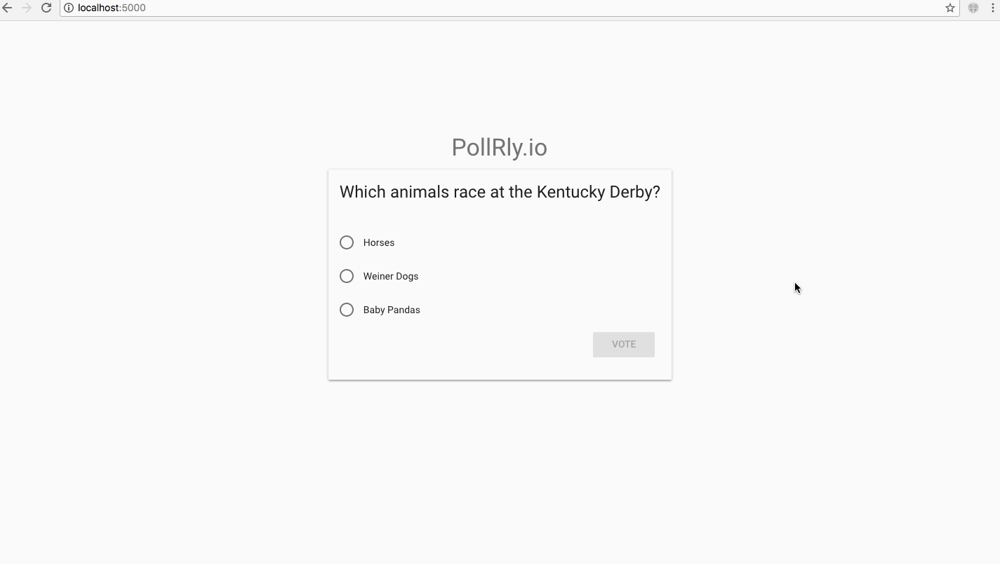
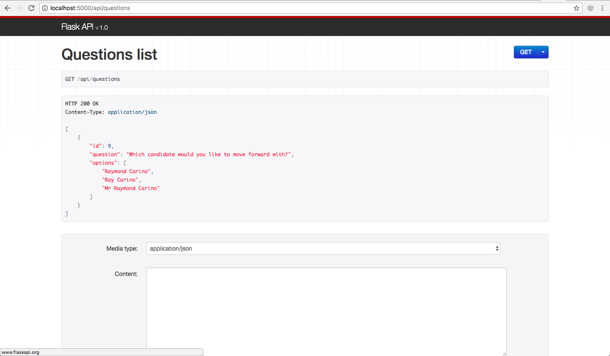
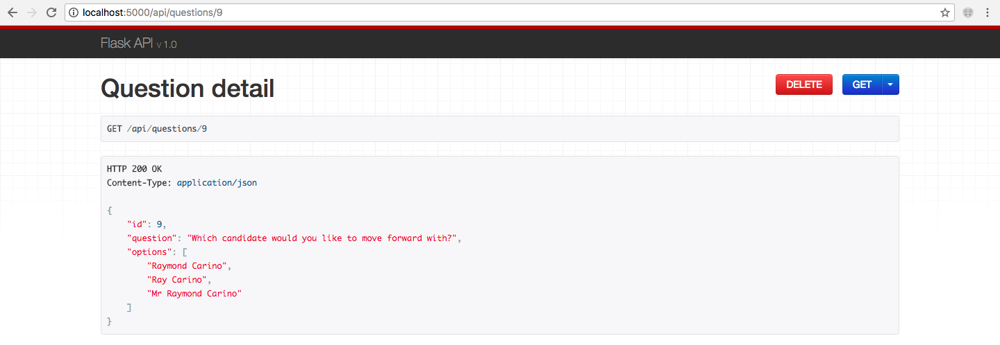
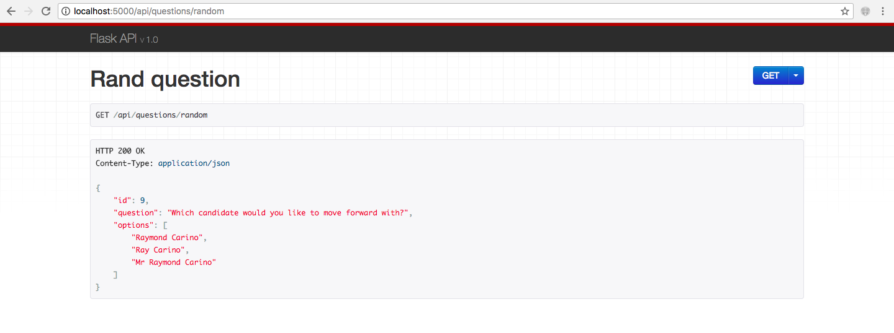
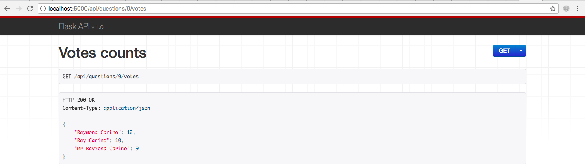
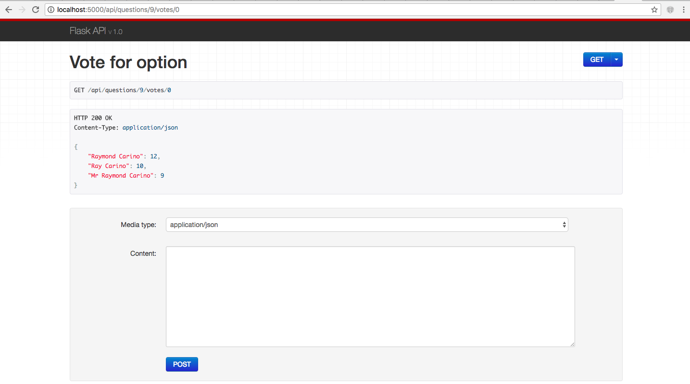

# PollRly.io
A revolutionary startup that will change the way the world responds to surveys.

## Prereqs/assumptions
1. You're running on osx and have python3/pip3 already available
2. localhost:5432 is open and you either don't have postgres, or it has default
   credentials: `user: postgres, no password`
3. Nothing is running on localhost:5000

## Setup
Please make sure you're comfortable with installing the following globally:
1. flask-api and psycopg2 onto global python3.
2. postgres via brew

From project root, run:
`build_and_run.sh`
to build and start the flask server.

Navigate to localhost:5000 in your browser.

## High Level Architecture
The overarching objective was to minimize the amount of code I had to write, while
keeping the product presentable.

1. Backend is in flask / postgres using psycopg2 as a db client
2. Frontend (/static) is a forked react-material example template

## API browser
Flask-API provides an API browser for free:

[Question list](http://localhost:5000/api/questions):

[Question detail](http://localhost:5000/api/questions/1):

[Random Question](http://localhost:5000/api/questions/random):

[Votes detail](http://localhost:5000/api/questions/1/votes):

[Vote for option](http://localhost:5000/api/questions/1/votes/0):

