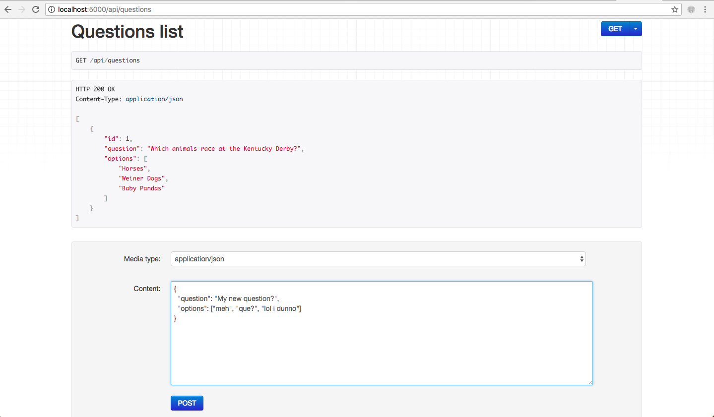

# PollRly.io
Simple web app that generates a random question which the user can vote on. After voting, the user will see a donut 
chart that breaks down votes by percentage and count.

Made with:
1. flask/python3 for backend
2. Postgres for persistence
3. react-material for frontend

## Prereqs/assumptions
1. You're running on osx and have python3/pip3 already available
2. localhost:5432 is open and you either don't have postgres, or it has default
   credentials: `user: postgres, no password`
3. Nothing is running on localhost:5000

## Setup
Please make sure you're comfortable with installing the following globally:
1. flask-api and psycopg2 onto global python3.
2. postgres via brew

From project root, run:
`build_and_run.sh`
to build and start the flask server.

Navigate to localhost:5000 in your browser.

## API browser
Flask-API provides a swagger-like API browser for free.

Example:

API endpoints:
1. [List/Create questions](http://localhost:5000/api/questions)
2. [Show/Delete a question](http://localhost:5000/api/questions/1)
3. [Show a random question](http://localhost:5000/api/questions/random)
4. [Show votes for a question](http://localhost:5000/api/questions/1/votes):
5. [Cast a vote for a question option](http://localhost:5000/api/questions/1/votes/0):
